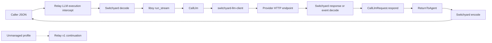

<!--
SPDX-FileCopyrightText: Copyright (c) 2026 NVIDIA CORPORATION & AFFILIATES. All rights reserved.
SPDX-License-Identifier: Apache-2.0
-->

# Switchyard NeMo Relay Dynamic Plugin

This crate builds the external `nvidia.switchyard` native plugin. It embeds
`switchyard-libsy`, drives `Algorithm::run_stream`, and uses
`switchyard-llm-client` for provider HTTP calls. Managed calls use Relay's
generic asynchronous middleware hooks and do not require a targeted provider
continuation from Relay.

The plugin uses NeMo Relay native API v1. It depends on the small
`nemo-relay-plugin` authoring SDK, not the Relay runtime, and does not start
`switchyard-server`. Managed provider calls do not use Relay's provider
continuation.

## Ownership boundary

For a managed LLM call:

1. Relay invokes the native LLM execution intercept.
2. The plugin decodes the caller JSON through `switchyard-translation`.
3. The plugin drives the configured libsy algorithm with `run_stream` and
   records each genuine decision.
4. For every `CallLlm`, the plugin's `switchyard-llm-client` instance translates
   the neutral request, applies the selected target's URL and credentials, and
   performs the HTTP request.
5. The plugin passes the real buffered response or response stream to
   `CallLlmRequest::respond` and continues until `ReturnToAgent`.
6. The plugin encodes the final neutral response into the caller's protocol.

Relay still owns the outer LLM lifecycle, dynamic-plugin loading, plugin
configuration, and event substrate. Relay's downstream LLM continuation is
used only for calls whose inbound protocol is not managed by this plugin.



This boundary has two important consequences:

- Managed provider calls do not traverse Relay middleware registered after the
  Switchyard intercept and do not use the host's provider callback. Provider
  transport activity is therefore not represented as nested Relay LLM
  lifecycle events. Relay records the outer managed call and the plugin emits
  Switchyard routing marks; bridging Switchyard transport spans into Relay is
  future work. With an exported Agent or turn scope, Relay 0.7 projects the
  outer LLM span and routing-decision span as siblings in one OpenInference
  trace. The native callback cannot parent an asynchronous decision mark
  directly under the active LLM event; an embedded host that invokes an LLM
  without an exported parent scope would therefore produce an orphan decision
  span.
- Switchyard owns provider URLs, credentials, HTTP retry behavior, and
  translation for managed calls. Relay neither validates nor transports those
  target details.

## Native API v1 and asynchronous execution

The manifest remains `compat.native_api = "1"`, but this rebuilt plugin requires
the generic C host-table v3 extension shipped by Relay 0.7. It registers through
v3's completion-based buffered and incremental streaming hooks, returns
`Pending` immediately, and performs libsy and HTTP work on a plugin-owned Tokio
runtime. Relay's runtime workers therefore do not wait synchronously for
provider I/O.

The v3 stream hook retains Relay's bounded 32-event output queue. The plugin
retries a logical event when that queue is full, checks cancellation between
attempts, and releases every completion, continuation, stream, and captured
scope handle exactly once. Managed HTTP work is selected against Relay caller
cancellation, so dropping a buffered or streaming call drops its in-flight
request future.

Unmanaged profiles use the same generic v3 continuation hooks for pass-through.
V3's downstream stream callback has continue/cancel control but no asynchronous
acknowledgement, so it cannot provide true end-to-end backpressure. The adapter
uses a nonblocking bridge capped at 8 MiB of queued, encoded event payloads; it
also caps the queue at 256 events and safely rejects a pass-through stream that
outruns either bound. The byte cap does not include transient JSON parsing or
in-memory representation overhead. Direct host forwarding without this bound would
still require a small generic Relay hook, but not a targeted-provider contract.
Managed Switchyard streams do not use this pass-through bridge. None of the
managed HTTP or routing operations requires a targeted LLM continuation.

This is still a raw C boundary: Switchyard contains a small ownership adapter
for host strings and v3 handles because Relay 0.7 does not expose a safe Rust
facade for the generic async surface. That adapter is transport-independent;
all HTTP and routing behavior remains in Switchyard.

## Supported routers

This initial plugin supports exactly two libsy algorithms:

- seeded, weighted `random` routing; and
- capability-based `llm_classifier` routing, where a judge selects the weak or
  strong target before the final provider call.

`stage_router` and response-judging escalation are intentionally deferred.
Unsupported algorithm kinds are rejected instead of being approximated.

The plugin owns the outer routing retry loop. Each retry starts a fresh libsy
run. Random routing draws again; an algorithm configured with persistent state,
such as classifier session affinity, may intentionally retain its assignment.
Each target's built-in HTTP retry count is set to zero to avoid retrying a
failed target invisibly before reselection. A random target with `weight = 0`
is fallback-only and is not considered by the algorithm. Trusted fallback is
attempted at most once and, for streaming responses, only before the first
caller event is emitted. Outer routing retries are immediate and do not honor
provider `Retry-After` headers.

## Translation and stream fidelity

`switchyard-translation` is the only request, response, and event translation
layer. It decodes caller JSON into Switchyard's neutral protocol, encodes each
selected call for the target protocol, decodes provider results, and encodes
`ReturnToAgent` back to the caller protocol. Relay codecs are not used.

The current streaming contract uses the normalized `LlmResponseChunk`
representation and does not preserve a raw provider-event envelope.
Common text, usage, finish-reason, and tool-call fields can be translated, but
unknown provider-specific fields in same-protocol SSE events are not guaranteed
to survive the decode/libsy/encode round trip. The streaming helpers also do not
expose the buffered translation engine's reject-lossy diagnostics, so unsupported
cross-protocol stream fields may be normalized or omitted. Do not claim
lossless streaming until Switchyard exposes both a raw provider-event
preservation contract and an explicit reject-lossy stream policy.

## Configuration

During release-candidate validation the manifest declares
`compat.native_api = "1"` and Relay `>=0.7.0-rc.4,<1.0`, and the Rust SDK uses
the exact published `0.7.0-rc.4` crate. Before release, move both lower bounds
to stable `0.7.0`. The manifest API value selects the released v1 plugin
contract; the binary is built against the V3 C host table shipped on the Relay
0.7 line, which is why the minimum Relay version is not 0.6. Rebuild the bundle
when changing SDK versions rather than assuming Rust dynamic-library
compatibility from the manifest value alone.

A Relay project can configure a seeded weighted-random router as follows:

```toml
version = 1

[[plugins.dynamic]]
manifest = "/opt/switchyard-relay-plugin/relay-plugin.toml"

[plugins.dynamic.config]
version = 2
priority = 0
max_retries = 3

[plugins.dynamic.config.algorithm]
kind = "random"
seed = 42

[plugins.dynamic.config.default_targets]
openai_chat = "fast"

[plugins.dynamic.config.targets.fast]
model = "provider/model"
protocol = "openai_chat"
endpoint = "/v1/chat/completions"
base_url = "https://provider.example.com"
weight = 1

[plugins.dynamic.config.targets.fast.header_env]
authorization = "PROVIDER_AUTHORIZATION"
```

Target map keys such as `fast` are stable semantic names visible to libsy. The
target binding is authoritative for the provider model, protocol, endpoint,
base URL, weight, and headers. Each `default_targets` key both enables that
inbound protocol and names its trusted fallback.

`header_env` resolves target credentials in the plugin process at registration
time. Environment values must not appear in configuration, errors, routing
marks, spans, or debug output. The plugin does not inherit caller credentials
for managed calls. Each variable supplies the complete header value, so an
`authorization` value must include its scheme, such as `Bearer`.
Common credential headers, including `authorization` and `x-api-key`, are
rejected in static `headers` and must use `header_env`. Static headers remain
appropriate for non-secret routing or tenancy metadata.

The Switchyard client does not follow provider redirects, applies a 10-second
connect timeout and a 120-second inactivity timeout, caps buffered provider
responses at 64 MiB, and caps retained HTTP error bodies at 64 KiB. Default
error display and Relay rejection messages do not include provider bodies. The
shared SSE decoder rejects an individual provider event above 8 MiB before its
line buffer can grow without bound.

For `kind = "llm_classifier"`, the classifier target must use `openai_chat` or
`openai_responses`; libsy's judge request uses a JSON-schema response format
that cannot be represented losslessly by Anthropic Messages. The remaining
classifier fields map directly to libsy's capability classifier configuration.

Version-1 service configuration, decision-only execution, and observe-only
mode are rejected.

## Build and bundle

The crate is a source/build unit with `publish = false`. Operators install a
binary bundle rather than a Rust crate:

```bash
cargo build --release -p switchyard-nemo-relay-plugin
python3 crates/switchyard-nemo-relay-plugin/scripts/package_bundle.py \
  --library target/release/libswitchyard_nemo_relay_plugin.so \
  --output dist/switchyard-nemo-relay-plugin-linux-x86_64
```

On macOS the library suffix is `.dylib`; Windows builds use `.dll`. The bundle
builder creates the minimal Relay package: the shared library, a materialized
manifest with Relay's inline SHA-256 integrity digest, and the JSON schema.

Install the materialized bundle with Relay's normal lifecycle commands:

```bash
nemo-relay plugins validate /opt/switchyard-relay-plugin/relay-plugin.toml
nemo-relay plugins add /opt/switchyard-relay-plugin/relay-plugin.toml
nemo-relay plugins enable nvidia.switchyard
nemo-relay plugins inspect nvidia.switchyard
```

## Validation expectations

Before release, validate both routers against buffered and streaming OpenAI
Chat, OpenAI Responses, and Anthropic Messages providers. The acceptance suite
must cover same- and supported cross-protocol routes, deterministic weighted
routing, independent runs, classifier weak and strong selections, retry
reselection, exhaustion, exactly-once fallback, stream commitment, empty
streams, late errors, cancellation, credential privacy, and unmanaged
pass-through.

The tests must also prove that managed target traffic reaches the provider
through `switchyard-llm-client`, never through Relay's provider continuation,
and that no Switchyard service or health endpoint is involved.
